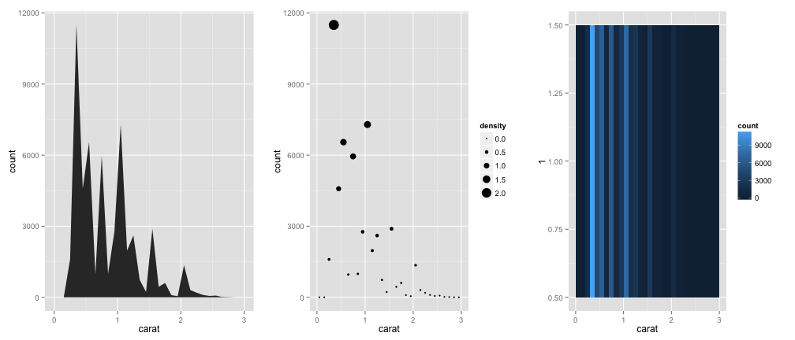

## A grammar of graphics

Wilkinson (2005) created a grammar of graphics to describe the deep features that underlie all statistical graphics as "parts of speech": 
   >- The ```data``` that you want to visualise
   >- An aesthetic mapping, ```aes``` for short, describing how variables in the data are mapped to aesthetic attributes that you can perceive
   >- geometric objects, ```geoms``` for short, representing what you actually see on the plot: points, lines, polygons, etc
   >- optional statistical transformations, ```stats``` for short, summarising data in many useful ways, e.g.
      - binning and counting observations to create a histogram
      - summarising the relationship between two variables with a linear model

---

## A grammar of graphics, cont'd

   >- a coordinate system, ```coord``` for short, describing how data coordinates are mapped to the plane of the graphic
      - also provides axes and gridlines to make it possible to read the graph
      - a Cartesian coordinate system, but a number of others are available, including polar coordinates and cartographic map projections
   >- ```scales``` which map values in the data space to values in one or more aesthetic spaces
      - indicate position in Cartesian or other 2-dimensional projections
      - encode values as colour, size or shape of symbols, lines
      - ```scales``` draw labelled axes and/or a legend
      - provide a reverse mapping to make it possible to read the original data values from the graph
   >- a ```facet``` specification describing how to break up the data into subsets and how to display those subsets as and arrangement of small multiples
    - known as conditioning or latticing/trellising ("panelling" in the Lattice package) 

---

## Grammar not pronounciation

   >- the Wilkinson grammar of graphics does not include finer points of display
      - font size or background colour, are not specified by the grammar
      - such attributes are analogus to pronunciation (or maybe typography?)
  
   >- ggplot2 specifies such attributes with a ```theming``` system
      - the default theme is very attractive, and thoughtfully designs
      - alternative themes come with the package
      - easy to tweak themes or design your own

   >- ggplot2 maintains a clean separation between:
      >- the ```data``` to be visualised
      >- the form of that visualisation (defined by the ```grammar```)
      >- how the rendered graphic looks (defined by the ```theme```)

---

## What ggplot2 doesn't do

   >- graphs are static, not interactive (e.g. brushing, zooming), but...
      - Hadley Wickham is rewriting ggplot2 in JavaScript, using the d3 library -> interactive graphs
      - the incremental, object-oriented nature of ggplot2 graphs make them ideal targets for interactive graph specification via Shiny or similar
   >- 3D graphics (cf lattice package for R)    
   >- exhaustive comparison of lattice vs ggplot2 capabilities and results in 12 parts at:
      - http://learnr.wordpress.com/2009/06/28/ggplot2-version-of-figures-in-lattice-multivariate-data-visualization-with-r-part-1/
      - ...through to...
      - http://learnr.wordpress.com/2009/08/18/ggplot2-version-of-figures-in-lattice-multivariate-data-visualization-with-r-part-13/

---

## ggplot2 versus other R graphics systems

>- base graphics in R
    - written by Ross Ihaka, University of Aukland, based on S graphics driver
    - use a pen-on-paper model: you can only draw on top of the plot, you cannot modify or delete existing content
    - no (user accessible) representation of the graphics, apart from their appearance on the screen
    - includes both tools for drawing primitives and entire plots.

>- grid graphics, a much richer system of graphical primitives, written in 2000 by Paul Murrell, also at University of Auckland
    - grid ```grobs``` (graphical objects) can be represented independently of the plot and modified later
    - viewports (each containing its own coordinate system) makes it easier to lay out complex graphics
    - provides drawing primitives, but no tools for producing statistical graphics

---

## ggplot2 versus other R graphics systems, cont'd

>- lattice package, developed by Deepayan Sarkar, uses grid graphics to implement the trellis graphics system of Bill Cleveland (1985)
    - easily produce conditioned plots
    - some plotting details (e.g., legends) taken care of automatically
    - but lacks a formal model, which can make it hard to extend (custom panel functions can be tricky to write)

>- ggplot2, also developed at University of Auckland!
    - also uses grid graphics for underpinnings
    - formal grammar
    - far more modular and object-oriented
    - strong separation of data, grammar and themes

---
  
## Installing ggplot2


```r
install.packages("ggplot2")
```


Optionally, some extra goodies

```r
install.packages("gridExtra")
install.packages("reshape2")
```


Don't forget to load the library

```r
library(ggplot2)
library(gridExtra)
```


---
  
## qplot()

>- mimics the ```plot()``` function in base graphics
>- don't use it
    - you miss out on all the good stuff in ggplot2
    - is fairly limited, so you'll end up learning the real ggplot2 functions anyway
>- by default creates a basic scatterplot
    - arguments: x variable, y variable, a data frame
>- all data used by ggplot2 needs to be in a data frame (cf base and lattice graphics)

---

## qplot()


```r
qplot(carat, price, data = diamonds)
```

 


---

## Functions can be used on variables

- true throughout ggplot2


```r
qplot(log(carat), log(price), data = diamonds)
```

 


---

## Additional arguments to modify qplot() output

```r
qplot(carat, price, data = diamonds, colour = color)
```

 


---

## ggplot2 graphics are objects

```r
p1 <- qplot(carat, price, data = diamonds, colour = color)
p2 <- qplot(carat, price, data = diamonds, shape = cut)
grid.arrange(p1, p2, ncol = 2)
```

 


---

## ggplot() - the real deal
- takes two arguments: a data frame, and an aesthetic mapping

```r
p <- ggplot(diamonds, aes(carat, price, colour = cut))
```


Hmmm, no output!

---

## Adding a geom

```r
p <- ggplot(diamonds, aes(carat, price, colour = cut))
p + geom_point()
```

 


---
## plots are R objects


```r
summary(p)
```

```
## data: carat, cut, color, clarity, depth, table, price, x, y, z
##   [53940x10]
## mapping:  x = carat, y = price, colour = cut
## faceting: facet_null() 
## -----------------------------------
## geom_point: na.rm = FALSE 
## stat_identity:  
## position_identity: (width = NULL, height = NULL)
```


- each element of the ggplot2 object can be modified or replaced by ggplot2 function
- or by your own custom functions

---

## replacing data in a plot object
- use the ```%+%```` operator to replace datasets in a graphic object


```r
p1 <- ggplot(mtcars, aes(mpg, wt, colour = cyl)) + geom_point()
mtcars <- transform(mtcars, mpg = mpg^2)
p2 <- p1 %+% mtcars
grid.arrange(p1, p2, ncol = 2)
```

 


---

## aesthetic mappings can be added to geoms as well


```r
p1 <- ggplot(mtcars, aes(mpg, wt)) + geom_point(aes(colour = cyl), size = 5)
p2 <- p1 + geom_line() + geom_smooth()
grid.arrange(p1, p2, ncol = 2)
```

 


---

## override geom default statistical mappings


```r
p <- ggplot(diamonds, aes(carat))
p1 <- p + geom_histogram()
p2 <- p + geom_histogram(aes(y = ..density..), binwidth = 0.1)
grid.arrange(p1, p2, ncol = 2)
```

 


---

## mixing stats with geoms

```r
d <- ggplot(diamonds, aes(carat)) + xlim(0, 3)
d1 <- d + stat_bin(aes(ymax = ..count..), binwidth = 0.1, geom = "area")
d2 <- d + stat_bin(aes(size = ..density..), binwidth = 0.1, geom = "point")
d3 <- d + stat_bin(aes(y = 1, fill = ..count..), binwidth = 0.1, geom = "tile")
grid.arrange(d1, d2, d3, ncol = 3)
```


---

## mixing stats with geoms
 


---

## other geoms: boxplots


```r
p <- ggplot(mtcars, aes(factor(cyl), mpg))
p + geom_boxplot()
```

 


---

## other geoms: boxplots + jittered points


```r
p1 <- p + geom_boxplot() + geom_jitter()
p2 <- p + geom_violin() + geom_jitter(height = 0)
grid.arrange(p1, p2, ncol = 2)
```

 


---

## other geoms: boxplots + flipped co-ordinates


```r
p + geom_boxplot(outlier.colour = "green", outlier.size = 5) + coord_flip()
```

 


---

## fill, dodge

```r
p1 <- ggplot(diamonds, aes(clarity, fill = cut)) + geom_bar()
p2 <- ggplot(diamonds, aes(clarity, fill = cut)) + geom_bar(position = "dodge")
grid.arrange(p1, p2, ncol = 2)
```

 


--- 

## different coordinate systems

```r
ggplot(diamonds, aes(clarity, fill = cut)) + geom_bar() + coord_polar()
```

 


---
  
## Tables
  
Mardown tables contain `---` and should not be interpreted as separator.

Column X | Column Y
---------|----------
Row 1    | Row 1
Row 2    | Row 2


--- bg:#662c91
  
## Animated List, Ordered
  
This list should be animated

> 1. Point 1
> 2. Point 2
> 3. Point 3

---
  
## Animated List, Unordered
  
This list should be animated

> - Point 1
> - Point 2
> - Point 3

--- bg:#EEE
  
## Background Color ##
  
This slide should have a subtle gray background.

--- bg:

## Background Image ##

This slide should have a background image.

---

## The End!


